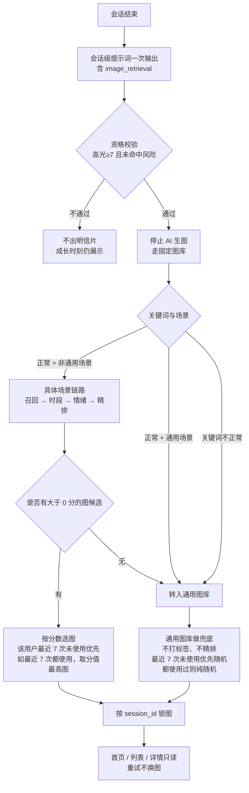

# 成长高光明信片配图规则说明

本文只讲 **高光时刻到成长高光明信片**。

会话级提示词：`会话级-洞察提示词_202608.md`

---

## 1. 高光时刻及配图的整体逻辑（从会话结束到出不出明信片）

下面同时保留两种阅读方式：先用原有等宽文本快速看顺序，再用 Mermaid 流程图查看分支关系。配图召回包始终由会话级提示词输出，但只有资格校验全部通过时才进入选图流程。

**文本流程：**

```text
会话结束
    |
    v
会话级洞察提示词（一次 LLM）
    输出原有字段 + highlight_info.image_retrieval
    （image_scene、event_period、emotion_level_1、image_keywords）
    |
    v
资格校验：has_highlight = true 且 highlight_score >= 7 且未命中风险
    |
    +-- 不通过 -> 不出明信片；成长时刻仍展示
    |
    +-- 通过 -> 停止 AI 生图，走固定图库，只读 image_retrieval
            |
            +-- 正常 + 非通用场景
            |     具体场景链路：召回 → 时段 → 情绪 → 精排
            |     是否有大于 0 分的图候选？
            |       有 -> 按分数选图（该用户最近 7 次未使用优先；都用过则取分值最高图）-> 锁图
            |       无 -> 转入通用图库
            |
            +-- 正常 + 通用场景 -> 通用图库
            +-- 关键词不正常     -> 通用图库
                    |
                    通用图库做兜底：不打标签、不精排
                    最近 7 次未使用的图优先，随机选 1 张；都使用过则纯随机 -> 锁图
            |
            锁图按 session_id 固定；首页 / 列表 / 详情只读，重试不换图
```

**流程图：**

下图只画主干分支。具体场景打分与最近 7 次去重、通用图库随机选图细则见 §4.3。本规则没有 `no_match` 的场景，通用图库做兜底：资格通过后，具体场景选不出图也一律进入通用图库。



要点：

- LLM **不判断**出不出明信片，只打分、标风险、给出 `image_retrieval`。
- LLM **不输出图片 ID**。选哪张图是后端的事。
- 未达高光时，`image_retrieval` 仍然要输出，方便抽检；后端不用它选图。
- 首日无对话时展示的“宝贝和 Lukie 第一次见面啦”是首页预设卡，不经过会话资格判断和选图任务。默认素材仅供客户端资源异常时临时占位，后端选图任务不使用它。
- `dimension`、`healing_quote`、`topic_tags` **不进入**选图。
- 图片氛围安全只约束具体场景素材的入库与运行时排斥；通用图库不打标签，不做氛围过滤。
- 召回不做评分。精排只发生在「正常 + 非通用场景」的具体场景层：主体 / 事件 / 动作打分。使用记录按该用户最近 7 次判断：具体场景层按分数选图时优先未使用；通用图库随机时同样避开这 7 次。进入通用图库后不打标签、不精排、不按时段或情绪过滤。最近 7 次未使用的图优先，随机选 1 张；都使用过则纯随机。本规则没有 `no_match` 的场景，通用图库做兜底。细则见 §4.3。

---

## 2. 收集用户生图必要内容：会话级提示词输出的 JSON 与配图召回包 `image_retrieval`

### 2.1 会话级提示词输出的 JSON

以下为中文输出语言下的完整结构示例。`image_retrieval` 是会话级提示词同一次 JSON 输出中的子对象；提示词不得输出图片 ID，后端根据该对象完成选图。

```json
{
  "session_mood_score": 78,
  "session_title": "帮助朋友找回橡皮",
  "session_summary": "孩子分享了帮助朋友找回橡皮的经历，也说出看到朋友不再着急时自己很开心。这段主动关心他人的体验体现了真实的同理心。",
  "emotion_level_1": "开心",
  "emotion_labels_level_2": [
    {"label": "🌟 开心", "standard_tag": "开心", "count": 3},
    {"label": "🤝 关心", "standard_tag": "关心", "count": 1}
  ],
  "topic_tags": [
    {"label": "#🧑‍🤝‍🧑友谊", "standard_tag": "友谊", "type": "normal", "risk_category": "", "count": 3, "scene_hint": "朋友社交", "co_emotion": "开心"}
  ],
  "risk_judgement": {"is_hit": false, "level": "", "category": []},
  "risk_ai_guidance": "",
  "highlight_info": {
    "highlight_score": 8,
    "has_highlight": true,
    "dimension_id": 5,
    "dimension": "价值观与品格闪光",
    "dialogue_snippet": [
      {"speaker": "Child", "text": "我把橡皮还给他了，他就不着急了，我也觉得很开心。"}
    ],
    "image_retrieval": {
      "image_scene": "朋友社交",
      "event_period": "day",
      "emotion_level_1": "开心",
      "image_keywords": ["朋友", "帮助朋友", "分享"]
    }
  },
  "healing_quote": {"title": "温柔的帮助，让彼此都安心"}
}
```

会话级提示词在一次 JSON 输出中，将配图召回包写入 `highlight_info.image_retrieval`。它不是总结原文，也不是话题标签。后端选图只读取这 4 个字段，不从 `session_summary`、`dialogue_snippet`、`topic_tags` 或其他本轮输出反推。

| 字段 | 取值 | 干什么 |
| --- | --- | --- |
| image_scene | 12 类中文场景之一 | 具体场景粗召回：先圈同场景图。值为「通用」时不走具体场景，直接进通用图库 |
| event_period | day / night / unknown | 仅具体场景层粗过滤：白天还是晚上；`unknown` 按 `day` 处理。通用图不读该字段 |
| emotion_level_1 | 九类一级情绪之一，必须与顶层字段一致 | 仅具体场景层按 §2.4 排除明显冲突氛围，不参与加权排序。通用图不读该字段 |
| image_keywords | 会话 JSON：一个未分类数组，正常 2～4 个中文词，无事实为 `[]`。与图库三类标签个数无关 | 仅具体场景层精排：词去对 `subject_tags`（+3）、`event_tags`（+2）、`action_tags`（+1）。为空、全非法或场景为「通用」时进通用图库。1 个可用词仍精排；超过 4 个只取前 4 个 |

语义依据：输入层 `raw_session`（孩子原话、说到的地点/活动/对象、正文里的时间说法）。不要用本轮输出的 `session_summary`、`dialogue_snippet` 反推。
不用：`topic_tags`、`dimension`、`scene_hint`、`healing_quote`。

### 2.2 image_scene（12 类，粗召回）

**不要用 6 类高光维度代替场景。** `dimension` 说的是「为什么算高光」（认知突破、疗愈共鸣、品格闪光…），`image_scene` 说的是「画面发生在哪」。同一类高光可以落在完全不同的场景：恐龙问答是「动物自然」或「学习探索」，帮朋友是「朋友社交」，两者都可能是品格闪光。

12 类（**11 + 1**）：学习探索、绘画手工、音乐舞蹈、阅读故事、游戏娱乐、户外运动、动物自然、家庭陪伴、朋友社交、日常生活、情绪陪伴、通用。

> **待确认：**前 11 个是否即为本期确认的素材场景？`通用` 只作分流、不作为具体场景素材标签。待产品 / 运营确认后固定，见 §6。

- 有明确主场景：选 `raw_session` 里孩子着墨最多、或高光原话所在的那一类。
- 多场景并列、或说不清：通用。
- 篮球、跑步、踢足球等运动细项一律归为户外运动。这是粗召回，不是漏字段。

### 2.3 event_period（粗过滤）

| 值 | 何时用 |
| --- | --- |
| day | 早晨、上午、中午、下午、白天、放学后且天未黑 |
| night | 傍晚、晚上、夜里、睡前、昨晚 |
| unknown | 没可靠时间证据，或一段里白天晚上都有；后端按 `day` 处理 |

优先级：`raw_session` 正文里说的事件时间 > 上下文继承 > 明确正在发生才可参考消息时间 > 否则 unknown。`unknown` 表示会话没有可靠时段证据；进入选图时按 `day` 处理。
禁止只看发送时间，也禁止从总结猜。上午 11:00 说「昨晚踢球」必须是 night。

### 2.4 emotion_level_1（复制字段，并用于排斥冲突氛围）

复制会话顶层 `emotion_level_1`，不要另判。具体场景素材不打九类情绪标签，只标注受控的 `atmosphere`（氛围）。运行时仅对具体场景做“明显冲突排斥”，不做氛围加权或精细情绪匹配。通用图不打 `atmosphere`，不走本表。

| 会话 `emotion_level_1` | 必须排除的图片 `atmosphere` | 说明 |
| --- | --- | --- |
| 开心、好奇 | 无 | 六类安全氛围均可作为候选：温暖、鼓励、平静、中性、欢快、庆祝 |
| 平静 | 庆祝 | 避免过度庆祝感；欢快仍可保留 |
| 悲伤、沮丧、愤怒、焦虑、恐惧、压抑 | 欢快、庆祝 | 避免明显轻佻或过度兴奋；温暖、鼓励、平静、中性可用 |

这张表只用于具体场景素材的过滤，不改变候选排序，也不用于通用图库。通用图不打 `atmosphere` 等标签，进入通用图库后不做情绪排斥、不精排。最近 7 次未使用的图优先，随机选 1 张；都使用过则纯随机。运营保证通用图库始终有图可随机；资格通过后一定能选出 1 张。本规则没有 `no_match` 的场景，通用图库做兜底。

### 2.5 image_keywords（精排，主体 / 事件 / 动作）

只勾勒画面，不解释高光类型。`image_keywords` 是会话 JSON 里的 **一个未分类中文词数组**，不按三类分别输出。

**先分开两套个数，不要混用：**

| | 会话 JSON `image_keywords` | 图库三类标签 |
| --- | --- | --- |
| 谁填 | 会话级提示词，每轮会话一份 | 运营给**每一张**具体场景图打；与本轮 JSON 无关 |
| 形态 | 一个数组，词本身不标是主体还是事件 | `subject_tags`、`event_tags`、`action_tags` 三个数组 |
| 个数 | 正常 **2～4 个**；没画面事实为 `[]` | 主体 **1～4**、事件 **1～4**、动作 **1～4**（每张图各自计） |
| 个数影响什么 | 见下方「2～4 个管什么」 | 标签越多，越容易被本轮词命中；**不受**本轮是 2 个还是 4 个限制 |

| 类 | 几个（写入 JSON 时） | 取什么 | 例 |
| --- | --- | --- | --- |
| 主体 | 可以多个，不限 1 个 | 人、物、场所、知识对象、倾诉对象 | 爸爸、妈妈、足球、操场 |
| 事件 | 可以多个，不限 1 个 | 正在发生的事 | 帮助朋友、发现羽毛、想念奶奶 |
| 动作 | 可以多个；会话里没有可见动作则为 0，不补词 | 看得见的动作 | 分享、提问、拥抱 |

组装规则：每一类都可以取多个，写入同一个数组。某类证据不足就跳过，不要用评价词凑数。例如 `["爸爸", "妈妈", "足球", "操场"]` 四个都是主体、没有动作词，作为 **JSON** 也合格。图库具体场景图仍须至少打 1 个动作标签，见 §3.2.7。

**2～4 个管什么（只约束会话 JSON，不约束图库打标）：**

- **给模型的长度：**正常抽出 2～4 个词，避免只给 1 个太瘦，也避免一长串噪声。
- **后端分流：**只有 `[]`、全是非法词（场景名 / 品格词等）才进通用图库。**1 个可用词仍走具体场景精排。**超过 4 个时只取前 4 个打分，不因此进通用图库。
- **精排分数：**每个词去对图上的三类标签。同一类最多计 1 次（主体 +3、事件 +2、动作 +1，满分 6）。所以 4 个都是主体，分仍最多 +3；多几个主体的好处是更容易对上不同图，不是把分数加到 12。

图库侧打标见 §3.2.5–3.2.7。通用图不打这三类标签。

---

## 3. 图片素材库准备与标签化处理

固定素材库由两部分组成：OSS 中的图片 / 视频文件，以及业务数据库中的素材元数据和标签。当前素材库约 72～96 个，候选池通常只有个位数。本期不接入向量检索。

素材分成两类，标签规则不同：

- **具体场景素材**（`is_generic=false`）：**11 个**，打齐场景、时段、氛围和主体 / 事件 / 动作标签，供第 4 节召回、过滤和精排。
- **通用图库素材**（`is_generic=true`）：**1 个**，不打标签、不精排。只需能被识别为通用图并取到文件；进入通用图库后最近 7 次未使用的图优先，随机选 1 张；都使用过则纯随机。

此处 11 + 1 指场景类目，不是张数。11 个具体素材场景名单待确认，见 §2.2、§6。

### 3.1 图片素材库的两层数据分层

从图片素材库本身看，只有两层：OSS 文件层和业务数据库标签层。选图结果、使用记录和前端展示地址属于第 4 节的选图与展示阶段，不属于图片素材库。

| 层级 | 数据内容 | 关键字段（中文名） | 存储位置 | 与另一层的关联规则 |
| --- | --- | --- | --- | --- |
| 1. 图片 / 视频文件层 | 每个素材的一个图片或视频文件 | `oss_url`（OSS 文件地址） | OSS：`growth_postcard/{id}.{ext}` | OSS 只保存文件。素材标签表通过 `oss_url` 指向该文件；素材替换时直接替换 OSS 文件，设计师在本地管理文件版本。MVP 选图结果锁定 `image_id`，不锁定线上文件版本；替换同 ID 文件后，历史卡片允许同步显示新文件。 |
| 2. 标签层 | 素材元数据；具体场景素材的场景 / 时段 / 氛围 / 主体 / 事件 / 动作标签；通用图仅标记 `is_generic` | `id`（素材 ID）；`oss_url`（OSS 文件地址）；`asset_type`（素材类型）；`is_generic`（是否通用素材）；`is_default`（是否默认素材）；具体场景素材另有 `scene_tags`、`period`、`atmosphere`、`subject_tags`、`event_tags`、`action_tags` | 业务数据库素材表 | 通过 `oss_url` 与 OSS 文件对应。具体场景素材按场景、时段和标签查询；通用图只按 `is_generic=true` 圈池，不读标签。未来若要求历史画面不可变，再增加 `asset_version` 或在选图结果中保存 `oss_url` 快照。 |

#### 3.1.1 素材入库业务流程（运营 / 后台）

1. 将图片或视频上传到 OSS，获得唯一的 `oss_url`。
2. 在业务数据库创建素材记录，写入 `id`、`oss_url`、`asset_type`、`is_generic` 和 `is_default`。
3. **具体场景素材**：根据文件内容预填场景、时段、氛围和主体 / 事件 / 动作标签，并入业务库（AI 批量识别 + 人工校验）。
4. **通用图库素材**：不预填、不校验上述标签；只标记 `is_generic=true`。

具体场景素材必须打齐下方标签字段，缺少必填字段或校验不通过时不得进入具体场景候选。通用图不打这些标签。本链路 `asset_type` 必须是 `growth_postcard`；`daily_summary` 为扩展类型，见 §3.2.1。

### 3.2 图片标签填写规则与字段定义（AI 预标注 + 人工确认）

以下规则用于 **具体场景素材** 的 AI 生成标签建议和人工确认。通用图库素材、占位图的归类见 §3.2.2，不打场景以外的标签。

#### 3.2.1 `asset_type`（素材类型）

素材库按业务类型隔离候选池。枚举预留两类，字段表可后续复用；**本链路（成长高光明信片）只查询 `growth_postcard`**。

| 值 | 中文 | 用途 | 本期 |
| --- | --- | --- | --- |
| `growth_postcard` | 成长高光明信片 | 本文第 4 节选图；具体场景素材打齐标签，通用图不打标签、做兜底 | 启用 |
| `daily_summary` | 今日总结 | 扩展类型，后续复用同一套素材表与标签字段；不进入本链路候选池 | 预留，细则见《今日总结_配图规则说明.md》 |

同一张底图若视觉允许复用，必须分别写入两条素材记录、各标一种 `asset_type`，不能只靠文件名区分。其他类型的图片或视频不进入本链路的候选池。

#### 3.2.2 `scene_tags`（场景标签）

用场景归类同时区分具体场景图、通用兜底图和前端占位图，不再单列 `is_generic`、`is_default` 小节。

**11 个具体场景（参与后端选图）：**

- 填写 `scene_tags`，取值只能来自这 11 类：学习探索、绘画手工、音乐舞蹈、阅读故事、游戏娱乐、户外运动、动物自然、家庭陪伴、朋友社交、日常生活、情绪陪伴。不要打 `通用`。
- 每个素材至少 1 个场景标签；画面确实同时覆盖多个场景时可以填写多个，不设固定数量上限。
- 只填写画面真实覆盖的场景，不为了扩大召回而强行添加无关场景。
- 并记 `is_generic=false`、`is_default=false`，同时打齐时段、氛围和主体 / 事件 / 动作标签。
- 选图时，`image_scene` 命中 `scene_tags` 任一值即可进入粗召回；不要求两者完全一一对应。

**1 个通用图库（兜底，参与后端选图）：**

- 无法归入上述 11 类时，不填 `scene_tags`，并记 `is_generic=true`、`is_default=false`。
- **不打标签**：不填 `scene_tags`、`period`、`atmosphere`、`subject_tags`、`event_tags`、`action_tags`。
- 选图时不精排、不按时段或情绪过滤。最近 7 次未使用的图优先，随机选 1 张；都使用过则纯随机：先查该 `user_id` 最近 7 条成功使用记录，在未出现于这 7 次的通用图中随机；若这 7 次已覆盖全部通用图，则在全部通用图中随机。随机使用 `session_id` 作种子。

**前端资源异常占位图（不参与后端选图）：**

- 参与后端选图的素材均 `is_default=false`。
- 如配置前端图片资源异常占位图，可 `is_default=true`；该素材不参与任何后端查询、选图、落库或使用记录，仅由客户端在已选图片加载失败时临时展示。

#### 3.2.3 `period`（素材时段）

- 仅具体场景素材填写。每个素材只能填写 1 个值，只能是 `day` 或 `night`。
- 画面明确为白天填写 `day`，明确为夜晚填写 `night`。
- 画面无法区分昼夜时，根据主要光线和使用场景选择更接近的一档；图库不设置 `period=unknown`。
- 会话没有可靠时段证据时，`event_period=unknown`；后端选图时按 `period=day` 处理。

#### 3.2.4 `atmosphere`（素材氛围）

- 仅具体场景素材填写。每个素材只能填写 1 个氛围，只能从 `温暖`、`鼓励`、`平静`、`中性`、`欢快`、`庆祝` 6 类中选择。
- 按画面本身的整体氛围填写，不根据将要匹配的会话情绪反向标注。
- `压抑`、`孤立`、`冲突`、`惊吓` 等氛围不进入具体场景候选库。
- 通用图不打 `atmosphere`。

#### 3.2.5 `subject_tags`（主体标签）

- 仅具体场景素材填写。填写画面中真实可见的人、物、场所、知识对象或倾诉对象，例如“爸爸”“妈妈”“足球”“操场”“朋友”“乐高”。可以多个。
- 每张图填写 1～4 个，使用中文，每个词 1～6 个汉字；同类标签不得重复。这是**这张图自己的标签个数**，不要求等于本轮 `image_keywords` 的 2～4。

#### 3.2.6 `event_tags`（事件标签）

- 仅具体场景素材填写。填写画面中正在发生或明确呈现的事情，例如“帮助朋友”“发现羽毛”“搭城堡”。如果 `raw_session` 明确表达“好奇”“思考”等心理活动，也可以作为事件标签；不能只根据高光维度或其他抽象评价词添加。
- 每个素材填写 1～4 个，使用中文，每个词 1～6 个汉字；不要填写场景名、情绪名或抽象成长评价。`好奇`、`思考`只有在画面或会话事实明确支持时才填写。这是这张图自己的事件标签个数，与本轮 JSON 词数无关。

#### 3.2.7 `action_tags`（动作标签）

- 仅具体场景素材填写。填写画面中可以被看见的动作，例如“分享”“提问”“翻书”“拥抱”。
- 每个素材填写 **1～4 个**，使用中文，每个词 1～6 个汉字；同类标签不得重复。不要补“倾诉”“陪伴”等抽象词。
- 没有明确可见动作的图，不要放进具体场景库，改入通用图库。这是这张图自己的动作标签个数，与本轮 JSON 是否抽出动作词无关。

#### 3.2.8 文件替换与标签更新

图片或视频替换、标签修改时，直接更新 OSS 文件和业务数据库素材记录；设计师在本地保存文件历史版本，线上不维护 `asset_version` 字段。
由于本期不保留线上素材版本，历史选图结果通过 `image_id` 读取当前素材内容；如需追溯旧画面，由设计师本地文件版本负责。

#### 必打（选图直接读）

一张表同时覆盖具体场景图和通用兜底图。通用图只填识别与取文件字段，场景 / 时段 / 氛围 / 主体 / 事件 / 动作 **不填**。占位图（`is_default=true`）不进本表、不参与后端选图，见 §3.2.2。

| 字段 | 具体场景 | 通用图库 | 取值 | 选图时干什么 | 案例 |
| --- | --- | --- | --- | --- | --- |
| `id` | 必填 | 必填 | 稳定唯一 ID，不用文件名当主键 | 素材关联、落库、锁图 | `postcard_friends_03` / `postcard_generic_01` |
| `oss_url` | 必填 | 必填 | OSS 图片 / 视频地址 | 后端和前端直接取文件 | `https://oss.example.com/growth_postcard/...png` |
| `asset_type` | 必填 | 必填 | 本链路固定 `growth_postcard`；扩展预留 `daily_summary`（见 §3.2.1） | 圈池，不与今日总结混查 | `growth_postcard` |
| `is_generic` | 必填 `false` | 必填 `true` | 随 §3.2.2 场景归类 | 具体场景候选 / 通用图库随机 | `false` / `true` |
| `is_default` | 必填 `false` | 必填 `false` | 参与选图的素材均为 `false` | `true` 仅作前端资源异常占位，不参与后端选图 | `false` |
| `scene_tags` | 必填 | 不填 | 1 个及以上，取值为 11 类具体场景 | `image_scene` 命中任一场景即可进入粗召回 | `["朋友社交", "日常生活"]` |
| `period` | 必填 | 不填 | `day` / `night` | 对 `event_period=unknown` 按 `day` 处理 | `day` |
| `atmosphere` | 必填 | 不填 | 6 个氛围枚举之一，见下 | 图库安全准入；参与运行时冲突氛围排斥 | `温暖` |
| `subject_tags` | 必填 | 不填 | 1～4 个中文词，主体 | 精排，命中 +3 | `["朋友", "孩子"]` |
| `event_tags` | 必填 | 不填 | 1～4 个中文词，事件 | 精排，命中 +2 | `["帮助朋友"]` |
| `action_tags` | 必填 | 不填 | 1～4 个中文词，动作 | 精排，命中 +1 | `["分享", "递给"]` |

`scene_tags` 的可选值为 11 类具体场景：学习探索、绘画手工、音乐舞蹈、阅读故事、游戏娱乐、户外运动、动物自然、家庭陪伴、朋友社交、日常生活、情绪陪伴。会话级 `image_scene` 仍可以输出「通用」，表示本轮不走具体场景、直接进通用图库。

`period`：仅具体场景素材填写，只允许 `day` 或 `night`，不要一张图同时打两种时段。会话级提示词的 `event_period` 按原文证据输出 `day`、`night` 或 `unknown`；未获取到可靠时段证据时输出 `unknown`，后端仅在具体场景层将 `unknown` 转为图库 `period=day`。通用图不打 `period`。

`atmosphere` 只打 **1 个**，且只给具体场景素材打，不要把九类一级情绪直接当作图片标签。下表的“对应一级情绪”是人工打标时的推荐适配；“运行时排除的一级情绪”与 §2.4 的硬过滤一致，不是一对一绑定。具体场景素材只允许以下 6 类：

| 氛围 | 画面大致是 | 对应一级情绪（推荐） | 运行时排除的一级情绪 |
| --- | --- | --- | --- |
| 温暖 | 陪伴、靠近、被接住 | 平静、悲伤、沮丧、愤怒、焦虑、恐惧、压抑 | 无 |
| 欢快 | 笑、玩、轻松高兴 | 开心、好奇 | 悲伤、沮丧、愤怒、焦虑、恐惧、压抑 |
| 庆祝 | 欢呼、庆祝、过度兴奋 | 开心、好奇 | 平静、悲伤、沮丧、愤怒、焦虑、恐惧、压抑 |
| 鼓励 | 加油、尝试、被支持 | 好奇、沮丧、愤怒、焦虑、恐惧、压抑 | 无 |
| 平静 | 安静、稳定、不刺激 | 平静、悲伤、沮丧、焦虑、恐惧、压抑 | 无 |
| 中性 | 说不清情绪，不偏庆祝也不压抑 | 开心、好奇、平静、悲伤、沮丧、愤怒、焦虑、恐惧、压抑 | 无 |

通用图不打 `atmosphere`，也不走这张表。

#### 主体 / 事件 / 动作怎么打

看见什么打什么，1～6 个汉字。仅具体场景素材打这三类。主体、事件、动作都按画面事实填写，每类至少 1 个；动作必须是画面可见动作，没有可见动作的图改入通用图库，不要空数组凑具体场景。不要把场景名、品格词写进这三类。通用图不打这三类标签。

打标时可参考（不是封闭词表，图里没有就不要硬打）：

| scene_tags 例 | subject_tags 例 | event_tags 例 | action_tags 例 |
| --- | --- | --- | --- |
| 学习探索 | 书、黑板、地球仪 | 上课、问为什么 | 提问、翻书、观察 |
| 绘画手工 | 画、彩笔、剪刀 | 画画、做手工 | 绘画、涂色、粘贴 |
| 音乐舞蹈 | 钢琴、话筒、舞台 | 弹琴、跳舞 | 弹奏、歌唱、旋转 |
| 阅读故事 | 书、故事书 | 讲故事、独立阅读 | 朗读、翻书 |
| 游戏娱乐 | 乐高、积木、棋盘 | 搭城堡、玩游戏 | 搭建、玩耍 |
| 户外运动 | 球、跑道、自行车 | 踢球、跑步 | 奔跑、踢球、骑车 |
| 动物自然 | 恐龙、狗、花、星星 | 发现羽毛、看星星 | 观察、触摸、提问 |
| 家庭陪伴 | 爸爸、妈妈、奶奶 | 一起吃饭、想家人 | 拥抱、陪伴、倾诉 |
| 朋友社交 | 朋友、同学 | 帮助朋友、一起玩 | 分享、递给、拥抱 |
| 日常生活 | 书包、餐桌、床 | 上学、吃饭、睡觉 | 走路、收拾、躺下 |
| 情绪陪伴 | 孩子、lukie | 被安慰、说心事 | 倾诉、拥抱、陪伴 |

不要给通用图打这三类标签。通用图只标 `is_generic=true`，不出现在上表。

一张图只打画面里 **真有的** 人/物/事/动作。帮朋友递东西：`["朋友"]` / `["帮助朋友"]` / `["分享","递给"]`。不要补「善良」。

#### 禁止打（选图不用，打了也要忽略）

- 6 类高光 `dimension`（认知突破、疗愈共鸣、品格闪光…）
- 九类 `emotion_level_1`（开心、悲伤…）
- 疗愈金句、话题标签、`scene_hint`
- 评价词：善良、勇敢、成长、突破、想象力、心流、里程碑

#### 样例

具体场景素材：

```json
{
  "id": "postcard_friends_day_03",
  "oss_url": "https://oss.example.com/growth_postcard/postcard_friends_day_03/2026-08-mvp.png",
  "asset_type": "growth_postcard",
  "scene_tags": ["朋友社交"],
  "period": "day",
  "atmosphere": "温暖",
  "subject_tags": ["朋友", "孩子"],
  "event_tags": ["帮助朋友"],
  "action_tags": ["分享", "递给"],
  "is_generic": false,
  "is_default": false
}
```

通用图库素材（不打标签）：

```json
{
  "id": "postcard_generic_01",
  "oss_url": "https://oss.example.com/growth_postcard/postcard_generic_01.png",
  "asset_type": "growth_postcard",
  "is_generic": true,
  "is_default": false
}
```

会话字段和图库字段的对应：

| 会话 `image_retrieval` | 图库标签 | 关系 |
| --- | --- | --- |
| `image_scene` | `scene_tags` | 具体场景初查时命中任一场景即可进粗召回；通用图补查只查询 `is_generic=true AND is_default=false`，不读场景标签 |
| `event_period` | `period` | 仅具体场景层：输入 day/night 时取对应时段；输入 unknown 时按图库 `day` 处理。通用图不读 `period` |
| `emotion_level_1` | `atmosphere` | 仅具体场景层按 §2.4 排除明显冲突氛围；不做加权。通用图不读 `atmosphere` |
| `image_keywords` | `subject_tags` / `event_tags` / `action_tags` | 仅具体场景层用 JSON 里的词去对图上三类标签打分。两边个数各自计算：JSON 正常 2～4；每张图主体、事件、动作均为 1～4。通用图不读这三类标签 |

MVP 大约 72-96 张落在 **11 个**具体场景（× 白天/晚上 × 每格 3-4 张）；另有 **1 个**不打标签的通用图库做兜底，只保证有可随机的池，不按关键词、时段或氛围另扩一套图。先保证 11 个具体场景 × 时段有深度，主体/事件/动作在已有具体场景图上补。

---

## 4. 成长高光明信片选图任务（仅高光达标之后）

`asset_type = growth_postcard`。这是成长高光明信片图库的业务类型。

### 4.1 任务触发与资格（后端算，提示词不新增资格字段）

会话级 `session_insight` 成功落库后，后端先校验 `image_retrieval` 的输入契约，再校验以下高光资格；全部通过才创建选图任务。

```text
has_highlight = true
AND highlight_score >= 7
AND risk_judgement.is_hit = false
```

不通过：不创建选图任务，不写图片使用记录。

### 4.2 选图用到的数据

只读 `highlight_info.image_retrieval` 这一包和素材库标签表。该对象及其中 4 个字段均为必填；任一字段缺失、类型错误或对象结构不完整时，判为输入不合格，不创建选图任务，不回退顶层字段。

- `session_id`：一张明信片绑一段会话，重试不换图
- `image_scene`、`event_period`：具体场景初查时，`image_scene` 与素材库的 `scene_tags` 做“命中任一值”匹配；通用图查询条件固定为 `asset_type=growth_postcard AND is_generic=true AND is_default=false`，不读场景、时段、氛围或主体 / 事件 / 动作标签
- `emotion_level_1`：与顶层字段一致；仅具体场景层按 §2.4 排除明显冲突氛围，不参与加权排序；通用图不读该字段做过滤
- `image_keywords`：仅「正常 + 非通用场景」时，在具体场景候选里按主体 / 事件 / 动作打分。空或全非法进通用图库；1 个可用词仍精排；超过 4 个只取前 4 个。进入通用图库后不打标签、不精排
- `risk_judgement`：资格里已经拦过；字段缺失则保守不出明信片
- 当前 `user_id` 最近 7 次成功图片使用记录，口径见 §4.3.2

非法值处理（原始 JSON 不改写，原因记日志）：

| 情况 | 怎么用 |
| --- | --- |
| image_retrieval 对象或任一必填字段缺失 / 类型错误 | 输入不合格：不创建选图任务，记录 `invalid_input` |
| image_scene 不在 12 类 | 保留原始 JSON，按 `通用` 归一，并记录 `invalid_image_scene` |
| event_period 非法 | 保留原始 JSON，按 `unknown` 归一，选图时按 `day` 处理，并记录 `invalid_event_period` |
| emotion_level_1 值非法（不在九类） | 保留原始 JSON，记录 `invalid_emotion_level_1`；该字段仅用于 §2.4 情绪排斥，值非法时跳过情绪排斥、按其余条件（场景 / 时段 / 关键词）继续选图，不因此放弃明信片 |
| image_keywords 为空、全非法，或写成场景名 / 品格词 | 保留任务并记录 `invalid_image_keywords`；不走具体场景，直接进专用通用图库 |
| image_keywords 仅 1 个可用词 | 仍走具体场景精排，不进通用图库 |
| image_keywords 超过 4 个 | 只取前 4 个打分；不记非法、不进通用图库 |

### 4.3 匹配顺序

整段只读 `image_retrieval` 和素材标签表，按流程图主干执行。精排只发生在具体场景层，见 §4.3.1；具体场景选图与通用图库随机见 §4.3.2。

| 步骤 | 流程节点 | 处理规则 | 详细说明 |
| --- | --- | --- | --- |
| 1 | 资格通过 | 校验高光资格和输入字段 | 资格不通过则结束，不创建选图任务；资格条件见 §4.1。 |
| 2 | 素材候选范围 | 只查询 `asset_type=growth_postcard` 且 `is_default=false` 的素材 | 前端资源异常占位图不进入后端候选池。 |
| 3 | 分流 | 按关键词与场景三路分流 | **正常 + 非通用场景**走具体场景链路；**正常 + 通用场景**或**关键词不正常**直接进专用通用图库。 |
| 4 | 具体场景链路 | 召回 → 时段 → 情绪 → 精排 | 仅第 3 步走具体场景时执行。召回：`image_scene` 命中 `scene_tags` 任一值。时段：`day/night` 对应 `period`，`unknown` 按 `day`。情绪：按 §2.4 排除冲突氛围。 |
| 5 | 具体场景选图 | 是否有大于 0 分的图候选 | 有：按分数选图，该用户最近 7 次未使用优先，都用过则取分值最高图。无：不选 0 分图，转入通用图库。 |
| 6 | 通用图库做兜底 | 不打标签、不精排；最近 7 次未使用的图优先，随机选 1 张；都使用过则纯随机 | 查询条件：`asset_type=growth_postcard AND is_generic=true AND is_default=false`。不按时段、情绪或关键词过滤。最近 7 次未使用的图优先，随机选 1 张；都使用过则纯随机（同一会话结果固定）。本规则没有 `no_match` 的场景，资格通过后由通用图库兜底选出图。 |
| 7 | 锁图 | 按 `session_id` 固定最终选图结果 | 首页、列表、详情只读该结果；重试不得换图。 |

**查询顺序：**

| 顺序 | 查询范围 | 触发条件 |
| --- | --- | --- |
| 1 | 具体场景 `scene_tags` | 仅「正常 + 非通用场景」 |
| 2 | 专用通用图库（兜底） | 「正常 + 通用场景」、关键词不正常，或具体场景没有大于 0 分的图候选；不打标签、不精排；最近 7 次未使用的图优先，随机选 1 张；都使用过则纯随机 |

### 4.3.1 精排怎么做

精排只发生在「正常 + 非通用场景」的具体场景层，不处理最近 7 次使用记录，也不负责通用图补查。当前具体场景经过召回、时段和情绪硬过滤后，所有候选都要评分，包含最终得分为 0 分的图片。0 分图不作为具体场景选图候选。进入通用图库后不执行本节：通用图不打标签、不精排，按 §4.3.2 选图。

LLM 给的 `image_keywords` 是会话 JSON 里的未分类中文词（正常 2～4 个，如 `["朋友", "帮助朋友", "分享"]`）。谁是主体、谁是事件、谁是动作，不靠模型再标，靠图库三类标签接住。JSON 有几个词，和图上打了几个标签，不是同一件事。

| 图库字段 | 分 | 接什么 |
| --- | --- | --- |
| `subject_tags` | 3 | 人、物、知识对象、倾诉对象 |
| `event_tags` | 2 | 正在发生的事 |
| `action_tags` | 1 | 看得见的动作 |

对每一张候选图：

1. 拿每一个 keyword，去对这三类标签。命中规则：完全相同，或一方包含另一方（「朋友」对上「好朋友」算；「善良」「突破」对不上任何受控标签，忽略）。
2. 同一类标签最多计 1 次。三类都命中满分 6，只有主体则 3，全未命中则 0。词再多，同类也不再加分。
3. 输出每张图的总分，供 §4.3.2 按分数和使用记录选图。精排阶段不因 0 分删除候选，也不直接决定最终图片。

**评分示例：**

| 图 | 命中 | 得分 |
| --- | --- | ---: |
| 甲 | 主体 + 动作 | 3+1=**4** |
| 乙 | 事件 + 动作 | 2+1=**3** |

得分 4 > 3。不是比命中个数，而是主体权重高于事件。

不要按 `dimension`、疗愈金句、情绪或场景额外加权。

### 4.3.2 选图执行、降级与样例

本节按流程图两层执行：具体场景层按分数选图；通用图库做兜底，不打标签、不精排；最近 7 次未使用的图优先，随机选 1 张；都使用过则纯随机。安全图片是指已通过时段、情绪和素材安全校验的**具体场景**素材；大于 0 分的图候选还必须满足关键词精排分数大于 0。**具体场景层只在大于 0 分的图中选；通用图库不读标签、不精排，最近 7 次未使用的图优先，随机选 1 张；都使用过则纯随机。本规则没有 `no_match` 的场景，通用图库做兜底。**

**“使用过”的定义：**仅检查当前选图任务所属的 `user_id`。其他用户的使用记录不参与判断。查询该用户按 `used_at` 倒序的最近 7 条成功使用记录（不足 7 条则按现有条数）；记录中的 `image_id` 与候选图片相同时，即视为该图片已被该用户最近 7 次使用过。不按自然日窗口。具体场景层和通用图库共用这一口径。

**同一段会话不重复选图：**同一段会话再次触发选图时，必须沿用已有结果，不得另选一张。同一孩子的多段会话同时结束、偶发选到同一张图，本期可接受。见第 1 节流程图「锁图」。

**A. 具体场景层（正常 + 非通用场景）：**

1. 按总分从高到低排列；分数相同时按 `id` 升序排列。
2. 得分为 0 分的图片不作为具体场景的选图候选，但保留评分结果用于日志。
3. 从最高分开始逐张检查该用户最近 7 次是否使用过：未使用过立即选择并停止遍历；使用过则继续检查下一张大于 0 分的图。
4. 如果所有大于 0 分的图都已使用过，则取分值最高图；最高分相同按 `id` 升序取第一张。
5. 当前层只有 1 张大于 0 分的图时：未使用则直接选择；已使用则仍选择该图。
6. 没有大于 0 分的图候选时，不选 0 分图，转入专用通用图库。

**B. 通用图库做兜底（正常 + 通用场景、关键词不正常，或具体场景没有大于 0 分的图）：**

7. 查询专用通用图库：`asset_type=growth_postcard AND is_generic=true AND is_default=false`。不读场景、时段、氛围或主体 / 事件 / 动作标签，也不做精排。
8. 最近 7 次未使用的图优先，随机选 1 张；都使用过则纯随机。查该 `user_id` 最近 7 条成功使用记录（按 `used_at` 倒序，不足 7 条则按现有条数）。优先在 `image_id` 未出现于这 7 次的通用图中随机选 1 张；若这 7 次已覆盖全部通用图，则在全部通用图中纯随机选 1 张。同一会话重试必须保持原结果。最近 7 次里若含具体场景图，其 `image_id` 不在通用图库中，不影响本层候选。
9. 因关键词为空或非法进入本层时，额外记录 `invalid_image_keywords`。
10. 本规则没有 `no_match` 的场景，通用图库做兜底。运营保证通用图库始终有图，资格通过后一定选出 1 张。

示例：

```json
{
  "highlight_info": {
    "image_retrieval": {
      "image_scene": "朋友社交",
      "event_period": "day",
      "emotion_level_1": "开心",
      "image_keywords": ["朋友", "帮助朋友", "分享"]
    }
  }
}
```

| 候选 | 场景 | 时段 | 氛围 | 主体 / 事件 / 动作 | 处理 |
| --- | --- | --- | --- | --- | --- |
| A | 朋友社交 | day | 温暖 | 朋友 / 帮助朋友 / 分享 | 精排 6 分，进入选图判断 |
| B | 朋友社交 | day | 温暖 | 朋友 / 踢球 / 奔跑 | 精排 3 分，进入选图判断 |
| C | 朋友社交 | night | 温暖 | 朋友 / 帮助朋友 / 分享 | 同时段过滤掉 |
| D | 朋友社交 | day | 非法氛围 | 朋友 / — / — | 不属于 6 类安全氛围，入库校验时已拦截 |
| E | 学习探索 | day | 温暖 | 恐龙 / 发现羽毛 / 提问 | 场景不同，不进本层；关键词再准也不用 |

若 A、B 该用户均未出现在最近 7 次使用记录中，按分数选择 A。若 A 已使用而 B 未使用，则跳过 A，选择 B；若 A、B 都已使用没有可以候选的图片时，则回退选择 A。0 分图片不参与上述选择。

**使用记录示例：**

| 候选 | 得分 | 该用户最近 7 次 | 处理 |
| --- | ---: | --- | --- |
| A 图 | 6 分 | 出现在最近 7 次中 | 继续检查下一张正分安全图片 |
| B 图 | 5 分 | 未使用 | 选择 B 图 |
| C 图 | 0 分 | 未使用 | 不作为选图候选 |

如果 A、B 两张正分安全图片都已使用，则回退选择 A 图（分值最高）。

#### 样例：当前场景无关键词命中

如果具体场景候选全部为 0 分，按以下顺序处理：

| 查询范围 | 情况 | 处理 |
| --- | --- | --- |
| 朋友社交 | A 图 0 分、B 图 0 分 | 没有大于 0 分的图候选，转入通用图库 |
| 通用 | 不打标签、不精排 | 最近 7 次未使用的图优先，随机选 1 张；都使用过则纯随机 |

不得因为原始场景是朋友社交，就强行选择 0 分的具体场景图。

#### 样例：关键词为空或非法

| 输入情况 | 查询范围 | 处理 |
| --- | --- | --- |
| `image_keywords=[]` | 专用通用图库 | 记录 `invalid_image_keywords`；不打标签、不精排；最近 7 次未使用的图优先，随机选 1 张；都使用过则纯随机 |
| `image_keywords` 含场景名或品格词 | 专用通用图库 | 同上 |

#### 样例：`image_scene=通用`

`image_scene=通用` 时第一轮就查询专用通用图库，不再先查其他具体场景。无论关键词是否正常，进入通用图库后都不打标签、不精排；最近 7 次未使用的图优先，随机选 1 张；都使用过则纯随机。

---

## 5. 验收（本链路）

- 会话级一次输出含完整 `image_retrieval`；不输出图片 ID。
- `image_keywords` 有可用画面事实时正常为 2～4 个中文词（每类可多个，合计写入一个数组）；1 个可用词后端仍精排，超过 4 个只取前 4 个。没有可用画面事实时允许 `[]`，后端记录 `invalid_image_keywords` 并直接查询专用通用图库。这是会话 JSON 的长度，不是图库三类标签的个数。
- 6 分不出明信片；7 分且无风险才选图；8 分但命中风险也不出。
- 上午说昨晚踢球 -> event_period=night。
- 无主场景 -> `image_scene=通用`，直接进通用图库（最近 7 次未使用优先随机，都使用过则纯随机）；未获取到时间信息 -> `event_period=unknown`，仅具体场景层选图按 `day` 处理。
- 选图顺序对齐流程图：资格通过后按关键词与场景分流。具体场景层：召回 → 时段 → 情绪 → 精排 → 是否有大于 0 分的图候选 → 按分数选图（该用户最近 7 次未使用优先，都用过取分值最高）。通用图库做兜底：不打标签、不精排；最近 7 次未使用的图优先，随机选 1 张；都使用过则纯随机。本规则没有 `no_match` 的场景。不得跨场景硬搜，也不得用 `emotion_level_1`、dimension 或疗愈金句加权排序。
- 运营保证通用图库始终有图可随机。
- 具体场景图打齐：`scene_tags`、`period`、`atmosphere`、`subject_tags`、`event_tags`、`action_tags`。三类标签各至少 1 个；没有可见动作的图不进具体场景库。不打 6 类高光、九类情绪或品格词。通用图只标 `is_generic=true`，不打上述标签。

## 6. 规则确认记录

本节单列仍需技术或产品确认的事项。

### 待确认项

| 对应章节 | 待确认事项 | 责任方 / 建议 |
| --- | --- | --- |
| §2.2 | 场景分类为 11 + 1：前 11 个具体素材场景（学习探索、绘画手工、音乐舞蹈、阅读故事、游戏娱乐、户外运动、动物自然、家庭陪伴、朋友社交、日常生活、情绪陪伴）是否确认？第 12 项「通用」只作分流、不打在具体场景素材上 | 产品 / 运营确认后固定 11 类素材场景名单 |
| §7 | 客户端资源加载失败时的本地占位图素材 | 客户端确认内置占位资源；不改写已选结果、不记新的使用 |

## 7. 客户端资源加载异常

- 选图任务失败：按任务重试策略重试；超过重试上限后标记为 `failed`，不生成明信片，不使用后端默认图。
- 已成功落库的图片资源加载失败：客户端临时展示本地内置的通用占位图，不改写选图结果、不新增使用记录、不创建新任务。
- 占位资源自身不可用：记录 `default_asset_unavailable`，不使用未知图片替代。

---
